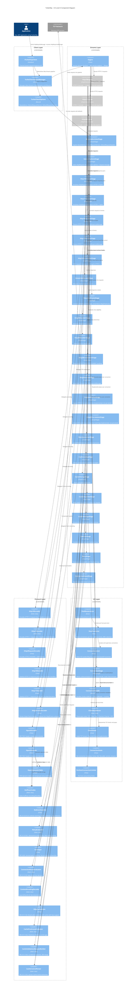

# TurboHttp — C4 Level 3 Component Diagram

```mermaid
C4Component
    title TurboHttp – C4 Level 3 Component Diagram

    Person(user, "Application", "Any .NET application using TurboHttp")

    Container_Boundary(client, "Client Layer") {
        Component(ITurboHttpClient, "ITurboHttpClient", "Interface", "Channel-based request/response API")
        Component(TurboClientStreamManager, "TurboClientStreamManager", "Class", "Manages Akka.Streams materialisation and lifecycle")
        Component(TurboClientOptions, "TurboClientOptions", "Record", "BaseAddress, DefaultRequestVersion, DefaultRequestHeaders")
    }

    Container_Boundary(streams, "Streams Layer") {
        Component(Engine, "Engine", "Class", "Version demux: Partition → per-version engines → Merge")

        Component_Ext(Http10Engine, "Http10Engine", "IHttpProtocolEngine", "HTTP/1.0 encode → connect → decode pipeline")
        Component_Ext(Http11Engine, "Http11Engine", "IHttpProtocolEngine", "HTTP/1.1 encode → connect → decode pipeline")
        Component_Ext(Http20Engine, "Http20Engine", "IHttpProtocolEngine", "HTTP/2 encode → connect → decode pipeline")

        Component(RequestEnricherStage, "RequestEnricherStage", "GraphStage", "Applies BaseAddress, DefaultRequestVersion, DefaultRequestHeaders")
        Component(ExtractOptionsStage, "ExtractOptionsStage", "GraphStage", "Splits HttpRequest into transport options + request message")

        Component(Http10EncoderStage, "Http10EncoderStage", "GraphStage", "Serialises HttpRequestMessage to HTTP/1.0 bytes")
        Component(Http11EncoderStage, "Http11EncoderStage", "GraphStage", "Serialises HttpRequestMessage to HTTP/1.1 bytes")
        Component(Http10DecoderStage, "Http10DecoderStage", "GraphStage", "Parses HTTP/1.0 bytes to HttpResponseMessage")
        Component(Http11DecoderStage, "Http11DecoderStage", "GraphStage", "Parses HTTP/1.1 bytes to HttpResponseMessage")
        Component(Http1XCorrelationStage, "Http1XCorrelationStage", "GraphStage", "FIFO request-response matching for HTTP/1.x")

        Component(StreamIdAllocatorStage, "StreamIdAllocatorStage", "GraphStage", "Allocates client stream IDs (1, 3, 5, …)")
        Component(Request2FrameStage, "Request2FrameStage", "GraphStage", "Converts (HttpRequestMessage, streamId) to Http2Frame list")
        Component(Http20EncoderStage, "Http20EncoderStage", "GraphStage", "Serialises Http2Frame to bytes")
        Component(Http20DecoderStage, "Http20DecoderStage", "GraphStage", "Parses bytes to Http2Frame")
        Component(Http20ConnectionStage, "Http20ConnectionStage", "GraphStage", "Flow control, SETTINGS/PING/GOAWAY handling")
        Component(Http20StreamStage, "Http20StreamStage", "GraphStage", "Assembles frames into HttpResponseMessage")
        Component(PrependPrefaceStage, "PrependPrefaceStage", "GraphStage", "Injects HTTP/2 connection preface (implemented, not yet wired)")
        Component(Http20CorrelationStage, "Http20CorrelationStage", "GraphStage", "Stream-ID-based request-response matching (implemented, not yet wired)")

        Component(DecompressionStage, "DecompressionStage", "GraphStage", "gzip/deflate/brotli response decompression")
        Component(CacheLookupStage, "CacheLookupStage", "GraphStage", "Checks cache before forwarding to engine")
        Component(CacheStorageStage, "CacheStorageStage", "GraphStage", "Stores cacheable responses")
        Component(CookieInjectionStage, "CookieInjectionStage", "GraphStage", "Adds matching cookies to outbound requests")
        Component(CookieStorageStage, "CookieStorageStage", "GraphStage", "Extracts Set-Cookie headers into CookieJar")
        Component(RedirectStage, "RedirectStage", "GraphStage", "Handles 3xx redirects with feedback loop")
        Component(RetryStage, "RetryStage", "GraphStage", "Evaluates retry eligibility with feedback loop")
        Component(ConnectionReuseStage, "ConnectionReuseStage", "GraphStage", "Signals keep-alive/close to I/O layer")
    }

    Container_Boundary(protocol, "Protocol Layer") {
        Component(Http10Encoder, "Http10Encoder", "Static class", "Encodes HTTP/1.0 request-line + headers to bytes")
        Component(Http11Encoder, "Http11Encoder", "Static class", "Encodes HTTP/1.1 request-line + headers + chunked body")
        Component(Http2RequestEncoder, "Http2RequestEncoder", "Class", "Encodes HTTP/2 HEADERS + DATA frames")
        Component(Http10Decoder, "Http10Decoder", "Class", "Stateful HTTP/1.0 response parser with remainder handling")
        Component(Http11Decoder, "Http11Decoder", "Class", "Stateful HTTP/1.1 response parser with chunked decoding")
        Component(Http2FrameDecoder, "Http2FrameDecoder", "Class", "Parses 9-byte frame headers + payload into Http2Frame subtypes")

        Component(HpackEncoder, "HpackEncoder", "Class", "RFC 7541 header compression encoder")
        Component(HpackDecoder, "HpackDecoder", "Class", "RFC 7541 header compression decoder")
        Component(HpackDynamicTable, "HpackDynamicTable", "Class", "FIFO dynamic table with 32-byte per-entry overhead")
        Component(HuffmanCodec, "HuffmanCodec", "Static class", "Static Huffman encoding/decoding")

        Component(RedirectHandler, "RedirectHandler", "Class", "RFC 9110 §15.4: method rewriting, HTTPS protection, loop detection")
        Component(RetryEvaluator, "RetryEvaluator", "Static class", "RFC 9110 §9.2: idempotency-based retry, Retry-After parsing")
        Component(CookieJar, "CookieJar", "Class", "RFC 6265: domain/path matching, Secure/HttpOnly/SameSite")
        Component(ConnectionReuseEvaluator, "ConnectionReuseEvaluator", "Static class", "RFC 9112 §9: keep-alive/close decision")
        Component(ContentEncodingDecoder, "ContentEncodingDecoder", "Static class", "gzip/deflate/brotli decompression")

        Component(HttpCacheStore, "HttpCacheStore", "Class", "RFC 9111 §3: thread-safe in-memory LRU cache with Vary support")
        Component(CacheFreshnessEvaluator, "CacheFreshnessEvaluator", "Static class", "RFC 9111 §4.2: freshness lifetime, current age")
        Component(CacheValidationRequestBuilder, "CacheValidationRequestBuilder", "Static class", "RFC 9111 §4.3: conditional requests, 304 merge")
        Component(CacheControlParser, "CacheControlParser", "Static class", "RFC 9111 §5.2: parses Cache-Control directives")
    }

    Container_Boundary(io, "I/O Layer") {
        Component(PoolRouterActor, "PoolRouterActor", "Actor", "Routes EnsureHost to per-host actors")
        Component(HostPoolActor, "HostPoolActor", "Actor", "Pools connections per host, enforces limits, MRU selection")
        Component(ConnectionActor, "ConnectionActor", "Actor", "Owns TCP socket lifecycle, exponential backoff reconnect")
        Component(ConnectionStage, "ConnectionStage", "GraphStage", "Writes outbound bytes to ConnectionHandle, reads inbound bytes")
        Component(ConnectionHandle, "ConnectionHandle", "Record", "Bundles OutboundWriter + InboundReader + HostKey")
        Component(ClientByteMover, "ClientByteMover", "Static class", "Three async tasks: TCP→Pipe, Pipe→Channel, Channel→TCP")
        Component(ClientState, "ClientState", "Class", "Holds TCP stream, Pipe, and channel reader/writers")
        Component(ConnectionState, "ConnectionState", "Class", "Per-connection metadata: Active, Idle, Reusable, version, streams")
        Component(PerHostConnectionLimiter, "PerHostConnectionLimiter", "Class", "Per-host concurrency limits")
    }

    System_Ext(tcp, "TCP Network", "Remote HTTP servers")

    %% User to Client
    Rel(user, ITurboHttpClient, "Sends HttpRequestMessage / receives HttpResponseMessage")
    Rel(ITurboHttpClient, TurboClientStreamManager, "Materialises Akka.Streams pipeline")
    Rel(ITurboHttpClient, TurboClientOptions, "Reads configuration")

    %% Client to Streams
    Rel(TurboClientStreamManager, Engine, "Feeds requests into pipeline")
    Rel(TurboClientStreamManager, RequestEnricherStage, "Enriches requests with defaults")

    %% Engine routing
    Rel(Engine, Http10Engine, "Routes HTTP/1.0 requests")
    Rel(Engine, Http11Engine, "Routes HTTP/1.1 requests")
    Rel(Engine, Http20Engine, "Routes HTTP/2 requests")

    %% HTTP/1.0 engine internals
    Rel(Http10Engine, Http10EncoderStage, "Encodes requests")
    Rel(Http10Engine, Http10DecoderStage, "Decodes responses")
    Rel(Http10Engine, Http1XCorrelationStage, "Correlates request-response pairs")

    %% HTTP/1.1 engine internals
    Rel(Http11Engine, Http11EncoderStage, "Encodes requests")
    Rel(Http11Engine, Http11DecoderStage, "Decodes responses")
    Rel(Http11Engine, Http1XCorrelationStage, "Correlates request-response pairs")

    %% HTTP/2 engine internals
    Rel(Http20Engine, StreamIdAllocatorStage, "Allocates stream IDs")
    Rel(Http20Engine, Request2FrameStage, "Converts requests to frames")
    Rel(Http20Engine, Http20EncoderStage, "Serialises frames to bytes")
    Rel(Http20Engine, Http20DecoderStage, "Parses bytes to frames")
    Rel(Http20Engine, Http20ConnectionStage, "Manages connection-level flow control")
    Rel(Http20Engine, Http20StreamStage, "Assembles response from frames")
    %% PrependPrefaceStage and Http20CorrelationStage are implemented but not yet wired into Http20Engine

    %% Response pipeline stages
    Rel(Engine, DecompressionStage, "Decompresses response bodies")
    Rel(Engine, CookieStorageStage, "Stores response cookies")
    Rel(Engine, CacheStorageStage, "Caches responses")
    Rel(Engine, RetryStage, "Evaluates retry eligibility")
    Rel(Engine, RedirectStage, "Handles 3xx redirects")
    Rel(Engine, CookieInjectionStage, "Injects cookies into requests")
    Rel(Engine, CacheLookupStage, "Checks cache before engine")
    Rel(Engine, ConnectionReuseStage, "Signals keep-alive/close")

    %% Stages to Protocol
    Rel(Http10EncoderStage, Http10Encoder, "Delegates encoding")
    Rel(Http11EncoderStage, Http11Encoder, "Delegates encoding")
    Rel(Http10DecoderStage, Http10Decoder, "Delegates decoding")
    Rel(Http11DecoderStage, Http11Decoder, "Delegates decoding")
    Rel(Http20EncoderStage, Http2RequestEncoder, "Delegates frame encoding")
    Rel(Http20DecoderStage, Http2FrameDecoder, "Delegates frame decoding")
    Rel(Http20StreamStage, HpackDecoder, "Decompresses headers")
    Rel(Request2FrameStage, HpackEncoder, "Compresses headers")
    Rel(HpackEncoder, HpackDynamicTable, "Maintains dynamic table")
    Rel(HpackDecoder, HpackDynamicTable, "Maintains dynamic table")
    Rel(HpackEncoder, HuffmanCodec, "Huffman encodes strings")
    Rel(HpackDecoder, HuffmanCodec, "Huffman decodes strings")

    Rel(RedirectStage, RedirectHandler, "Evaluates redirect rules")
    Rel(RetryStage, RetryEvaluator, "Evaluates retry rules")
    Rel(CookieInjectionStage, CookieJar, "Reads matching cookies")
    Rel(CookieStorageStage, CookieJar, "Stores Set-Cookie headers")
    Rel(ConnectionReuseStage, ConnectionReuseEvaluator, "Evaluates keep-alive/close")
    Rel(DecompressionStage, ContentEncodingDecoder, "Decompresses content")

    Rel(CacheLookupStage, HttpCacheStore, "Looks up cached responses")
    Rel(CacheStorageStage, HttpCacheStore, "Stores cacheable responses")
    Rel(CacheLookupStage, CacheFreshnessEvaluator, "Checks freshness")
    Rel(CacheLookupStage, CacheControlParser, "Parses Cache-Control")
    Rel(CacheStorageStage, CacheControlParser, "Parses Cache-Control")
    Rel(CacheLookupStage, CacheValidationRequestBuilder, "Builds conditional requests")

    %% Stages to I/O
    Rel(Http10Engine, ConnectionStage, "Reads/writes bytes over connection")
    Rel(Http11Engine, ConnectionStage, "Reads/writes bytes over connection")
    Rel(Http20Engine, ConnectionStage, "Reads/writes bytes over connection")
    Rel(ConnectionStage, ConnectionHandle, "Reads/writes via channels")

    %% I/O internal
    Rel(PoolRouterActor, HostPoolActor, "Creates per-host pool actor")
    Rel(HostPoolActor, ConnectionActor, "Creates and supervises connections")
    Rel(HostPoolActor, ConnectionState, "Tracks connection metadata")
    Rel(HostPoolActor, PerHostConnectionLimiter, "Enforces per-host limits")
    Rel(ConnectionActor, ClientByteMover, "Spawns async data pump tasks")
    Rel(ClientByteMover, ClientState, "Reads/writes TCP stream and pipes")
    Rel(ConnectionActor, ConnectionHandle, "Delivers handle to HostPoolActor")

    %% I/O to TCP
    Rel(ClientByteMover, tcp, "Manages TCP connections")

    UpdateRelStyle(user, ITurboHttpClient, $offsetY="-20")
```
