# Connection Flow Sub-Graph — `BuildConnectionFlowPublic`

This diagram shows the per-connection stream graph constructed by `Engine.BuildConnectionFlowPublic()` in
[`src/TurboHttp/Streams/Engine.cs`](../src/TurboHttp/Streams/Engine.cs).
Every protocol engine (HTTP/1.0, 1.1, 2.0) is wrapped in this topology inside its
`GroupByHostKey` / `MergeSubstreams` substream. The flow manages transport lifecycle
(connect, encode, decode, connection-reuse signalling) for a single host connection.

> **Reading guide:** Rounded boxes are `GraphStage` implementations. Diamond shapes are fan-out/fan-in
> junctions. Dashed arrows represent the feedback loop. The `ConnectionStage` is the boundary to
> the TCP network via the I/O actor pool.

```mermaid
flowchart TD
    IN(["⬇ HttpRequestMessage"]):::io

    subgraph ConnectionFlow["BuildConnectionFlowPublic (per host substream)"]
        direction TB

        extract(["ExtractOptionsStage"]):::stage

        subgraph BidiFlow["BidiFlow — Protocol Engine (TEngine)"]
            direction TB
            bidiIn1["Inlet1\n(request)"]:::port
            bidiOut1["Outlet1\n(encoded)"]:::port
            bidiIn2["Inlet2\n(raw bytes)"]:::port
            bidiOut2["Outlet2\n(decoded)"]:::port
        end

        concat{{"Concat(2)"}}:::junction
        transportMerge{{"MergePreferred"}}:::junction

        subgraph TCP["External Boundary — TCP Network"]
            connStage(["ConnectionStage\n(↔ PoolRouterActor → TCP)"]):::transport
        end

        connReuse(["ConnectionReuseStage"]):::stage
        selectBuf(["Select → Buffer(1)"]):::buffer

        %% ── Request path ────────────────────────────────────────────
        extract -->|"Out0\nHttpRequestMessage"| bidiIn1
        extract -->|"Out1\nConnectItem"| concat

        %% ── Transport outbound path ────────────────────────────────
        bidiOut1 -->|"IOutputItem\n(encoded)"| concat
        concat -->|"Out\nIOutputItem"| transportMerge
        transportMerge -->|"Out\nIOutputItem"| connStage

        %% ── Transport inbound path ─────────────────────────────────
        connStage -->|"IInputItem\n(raw bytes)"| bidiIn2

        %% ── Response path ───────────────────────────────────────────
        bidiOut2 -->|"HttpResponseMessage"| connReuse

        %% ── Signal feedback loop (dashed) ───────────────────────────
        connReuse -.->|"Out1\nConnectionReuseItem"| selectBuf
        selectBuf -.->|"IOutputItem"| transportMerge
    end

    IN --> extract
    connReuse -->|"Out0\nHttpResponseMessage"| OUT

    OUT(["⬆ HttpResponseMessage"]):::io

    %% ── Styles ──────────────────────────────────────────────────
    classDef stage fill:#4a90d9,stroke:#2c5f8a,color:#fff,rx:12,ry:12
    classDef transport fill:#e74c3c,stroke:#c0392b,color:#fff,rx:12,ry:12
    classDef junction fill:#f5a623,stroke:#c07d1a,color:#fff
    classDef io fill:#2ecc71,stroke:#1a9e4f,color:#fff,rx:16,ry:16
    classDef buffer fill:#9b59b6,stroke:#7d3c98,color:#fff,rx:8,ry:8
    classDef port fill:#34495e,stroke:#2c3e50,color:#fff,rx:4,ry:4

    linkStyle 6 stroke:#e74c3c,stroke-width:2px
    linkStyle 7 stroke:#e74c3c,stroke-width:2px
```

### Stages

| Stage | Source | Role |
|-------|--------|------|
| **ExtractOptionsStage** | [`Streams/Stages/ExtractOptionsStage.cs`](../src/TurboHttp/Streams/Stages/ExtractOptionsStage.cs) | Fan-out: first request produces a `ConnectItem` (Out1) for transport initialisation; all requests forwarded to BidiFlow (Out0) |
| **BidiFlow (TEngine)** | Protocol engine (`Http10Engine` / `Http11Engine` / `Http20Engine`) | Encode requests → `IOutputItem` (Outlet1); decode `IInputItem` → `HttpResponseMessage` (Outlet2) |
| **Concat(2)** | Akka built-in | Concatenates `ConnectItem` (In0, first) with BidiFlow encoded output (In1) — ensures connect happens before data |
| **MergePreferred** | Akka built-in | Merges normal data flow (In0) with signal feedback (Preferred) — signals take priority |
| **ConnectionStage** | [`IO/Stages/ConnectionStage.cs`](../src/TurboHttp/IO/Stages/ConnectionStage.cs) | Bridge to TCP: requests `ConnectionHandle` from `PoolRouterActor`, writes outbound bytes to `Channel`, reads inbound bytes from `Channel` |
| **ConnectionReuseStage** | [`Streams/Stages/ConnectionReuseStage.cs`](../src/TurboHttp/Streams/Stages/ConnectionReuseStage.cs) | Fan-out: evaluates keep-alive/close per RFC 9112 §9; responses go to Out0, `ConnectionReuseItem` signals go to Out1 |
| **Select → Buffer(1)** | Inline (`Flow.Select` + `Buffer`) | Casts `ConnectionReuseItem` to `IOutputItem` and buffers one element to break the feedback cycle |

### Data Flow Summary

1. **Request enters** → `ExtractOptionsStage` splits the first request into a `ConnectItem` (triggers TCP connect) and forwards requests to the protocol engine's BidiFlow.
2. **Encoding** → The BidiFlow encodes `HttpRequestMessage` into `IOutputItem` bytes, which flow through `Concat` (after the initial `ConnectItem`) into `MergePreferred`.
3. **Transport** → `MergePreferred` feeds `ConnectionStage`, which bridges to TCP via the I/O actor pool (`PoolRouterActor` → `HostPoolActor` → `ConnectionActor`).
4. **Decoding** → Raw bytes (`IInputItem`) from `ConnectionStage` enter the BidiFlow's decode side, producing `HttpResponseMessage`.
5. **Connection reuse** → `ConnectionReuseStage` evaluates each response: the response goes to the output, while a `ConnectionReuseItem` signal feeds back through `Buffer(1)` → `MergePreferred.Preferred` → `ConnectionStage` to communicate keep-alive/close decisions.
