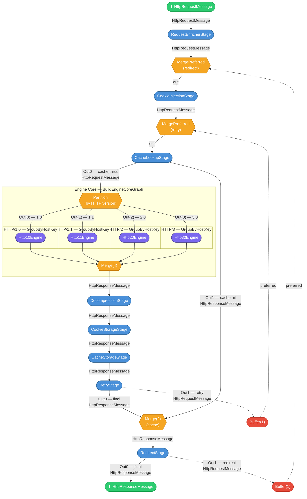

# Engine Stream Graph — `BuildExtendedPipeline`

This diagram shows the complete Akka.Streams graph constructed by `Engine.BuildExtendedPipeline()` in
[`src/TurboHttp/Streams/Engine.cs`](../src/TurboHttp/Streams/Engine.cs).
It covers the full request/response data flow including feedback loops for retries and redirects,
cache fan-out/fan-in, and the four-way HTTP version router.

> **Reading guide:** Rounded boxes are `GraphStage` implementations. Diamond shapes are fan-out/fan-in
> junctions. Dashed arrows represent feedback loops. Data types are annotated on key edges.

## Legend

| Shape | Meaning |
|-------|---------|
| Rounded box (blue) | `GraphStage` — stateless or stateful stream processing stage |
| Rounded box (purple) | Protocol engine — composite sub-graph (`IHttpProtocolEngine`) |
| Diamond (orange) | Fan-out / fan-in junction (`Partition`, `Merge`, `MergePreferred`) |
| Rounded box (red) | `Buffer(1, Backpressure)` — cycle-breaking buffer on feedback loops |
| Stadium (green) | Pipeline input / output |
| Solid arrow | Normal data flow |
| Dashed arrow | Feedback loop (retry or redirect) |

## Stage Reference

| Stage | Source | Purpose |
|-------|--------|---------|
| `RequestEnricherStage` | `Streams/Stages/RequestEnricherStage.cs` | Applies `BaseAddress`, `DefaultRequestVersion`, `DefaultRequestHeaders` |
| `CookieInjectionStage` | `Streams/Stages/CookieInjectionStage.cs` | Injects matching cookies from `CookieJar` (RFC 6265) |
| `CacheLookupStage` | `Streams/Stages/CacheLookupStage.cs` | Cache hit → Out1, cache miss → Out0 (RFC 9111 §4) |
| `DecompressionStage` | `Streams/Stages/DecompressionStage.cs` | gzip/deflate/brotli decompression (RFC 9110 §8.4) |
| `CookieStorageStage` | `Streams/Stages/CookieStorageStage.cs` | Stores `Set-Cookie` headers in `CookieJar` (RFC 6265 §5.3) |
| `CacheStorageStage` | `Streams/Stages/CacheStorageStage.cs` | Stores cacheable responses, merges 304 (RFC 9111 §3/§4.3.4) |
| `RetryStage` | `Streams/Stages/RetryStage.cs` | Out0 = final, Out1 = retryable request (RFC 9110 §9.2) |
| `RedirectStage` | `Streams/Stages/RedirectStage.cs` | Out0 = final, Out1 = redirect request (RFC 9110 §15.4) |
| `Partition` | Akka.Streams built-in | Routes by `HttpRequestMessage.Version` (1.0 / 1.1 / 2.0 / 3.0) |
| `Merge(4)` | Akka.Streams built-in | Merges four protocol engine outputs |
| `MergePreferred` | Akka.Streams built-in | Preferred inlet prioritises feedback over new requests |
| `Buffer(1)` | Akka.Streams built-in | Breaks backpressure cycle on feedback loops |
