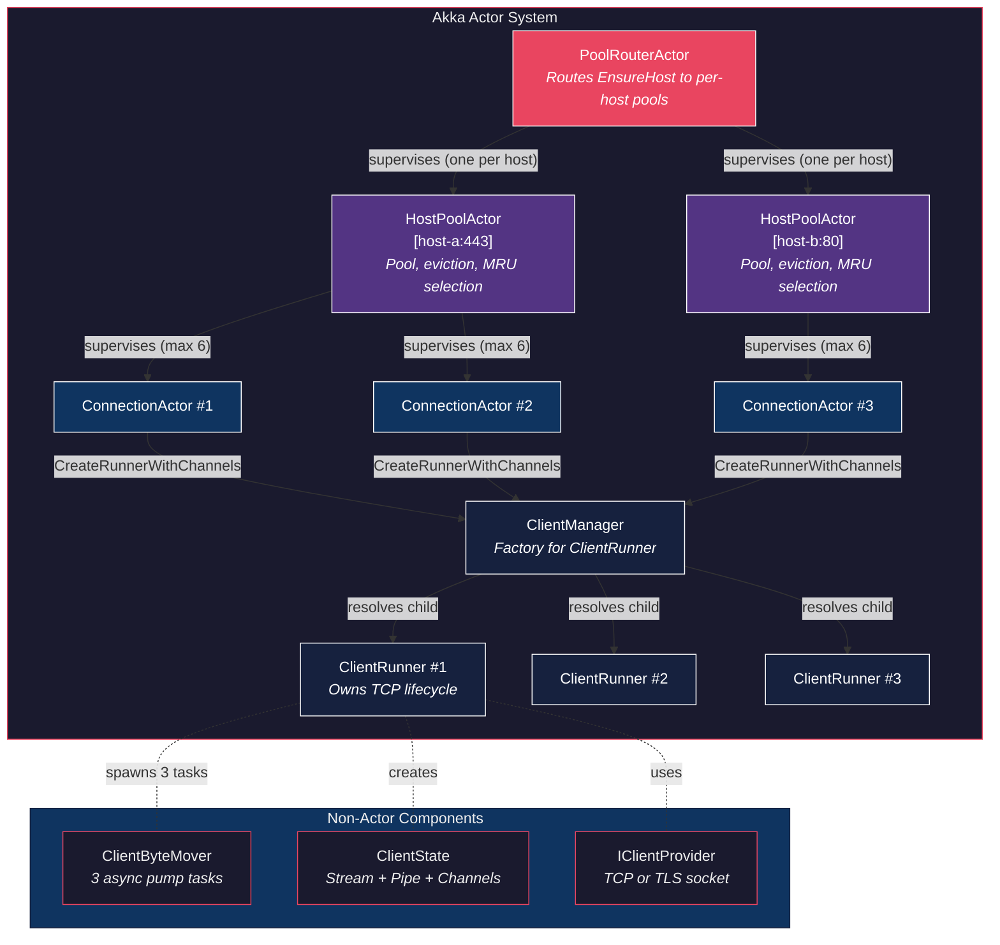
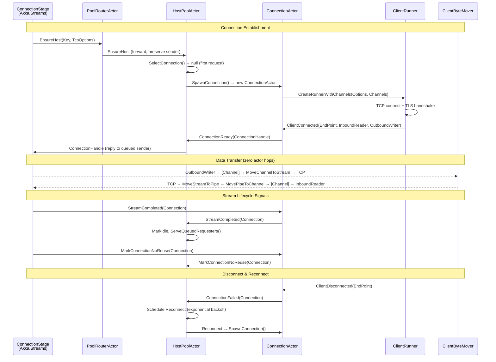
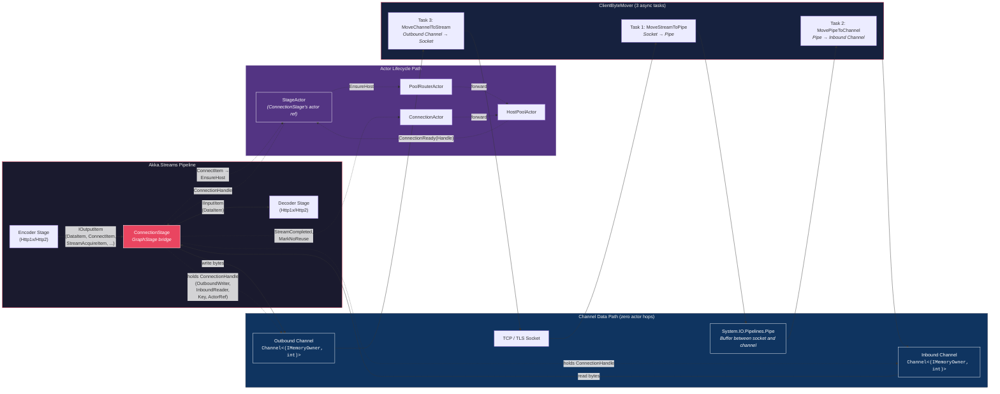

# TurboHttp — I/O Actor Hierarchy & Data Path

## Actor Supervision Tree



## Actor Message Flow



## ConnectionStage ↔ Actor Bridge via System.Threading.Channels



## ConnectionHandle — Data Path Bridge

`ConnectionHandle` is the key data structure that enables zero-actor-hop data transfer. It bundles direct channel references, bypassing actor mailboxes entirely for request/response bytes:

| Field | Type | Purpose |
|-------|------|---------|
| `OutboundWriter` | `ChannelWriter<(IMemoryOwner<byte>, int)>` | ConnectionStage writes serialized request bytes here |
| `InboundReader` | `ChannelReader<(IMemoryOwner<byte>, int)>` | ConnectionStage reads inbound response bytes from here |
| `Key` | `RequestEndpoint` | Connection identity: Scheme + Host + Port + Version |
| `ConnectionActor` | `IActorRef` | Owning actor for lifecycle message forwarding |
| `MaxConcurrentStreams` | `int` (volatile) | Updated by Http20ConnectionStage on SETTINGS frame |

## ClientByteMover — Three Concurrent Pump Tasks

Each TCP connection spawns three independent async tasks (no actor involvement):

| Task | Flow | Trigger on Failure |
|------|------|--------------------|
| `MoveStreamToPipe` | TCP Socket → `Pipe.Writer` | Tells runner `DoClose` |
| `MovePipeToChannel` | `Pipe.Reader` → Inbound `ChannelWriter` | Tells runner `DoClose` |
| `MoveChannelToStream` | Outbound `ChannelReader` → TCP Socket | Tells runner `DoClose` |

Any task failure triggers `ClientRunner.DoClose`, which propagates to `ConnectionActor` as `ClientDisconnected`, initiating reconnect with exponential backoff.

## ClientState — Per-Connection I/O Primitives

```
ClientState
├── Stream          — NetworkStream or SslStream (from IClientProvider)
├── Pipe            — System.IO.Pipelines buffer (pause/resume thresholds scale with MaxFrameSize)
├── InboundReader   — ChannelReader  (ClientByteMover writes, ConnectionStage reads)
├── InboundWriter   — ChannelWriter  (ClientByteMover writes here from Pipe)
├── OutboundReader  — ChannelReader  (ClientByteMover reads, sends to socket)
└── OutboundWriter  — ChannelWriter  (ConnectionStage writes here via ConnectionHandle)
```
