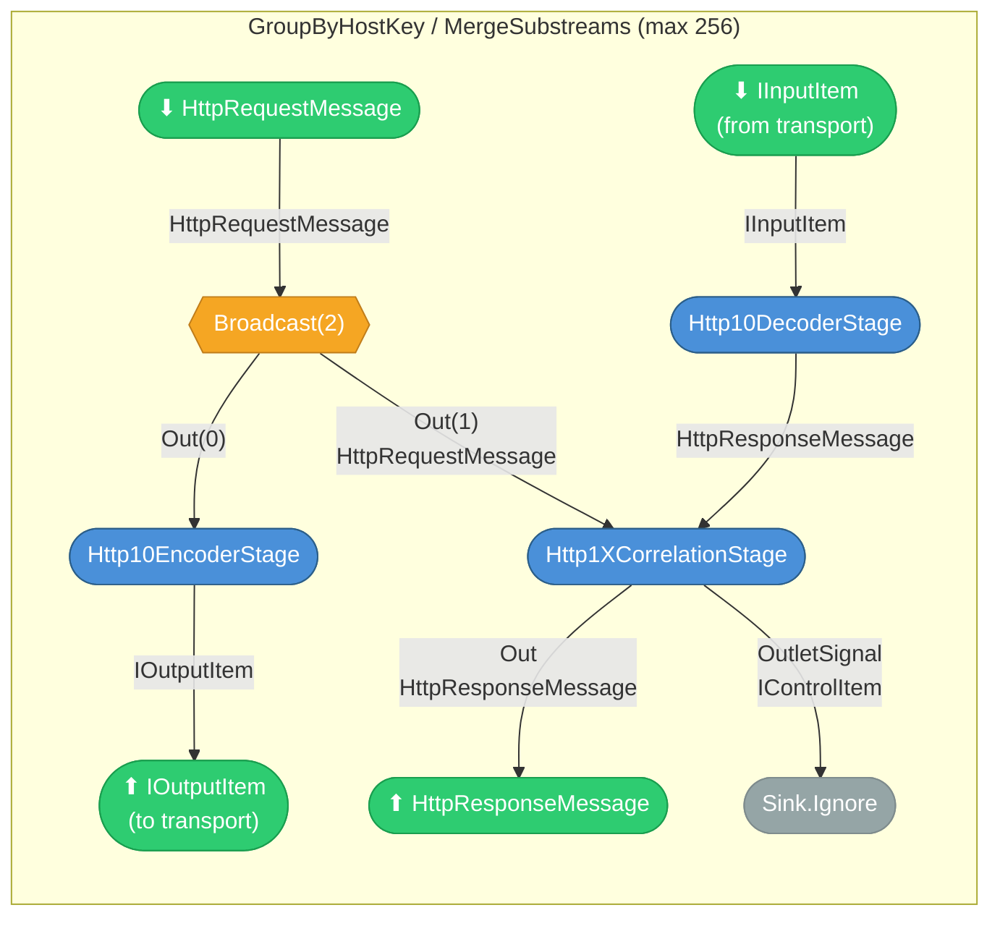
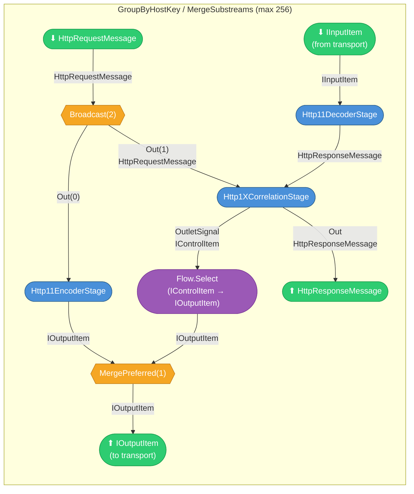
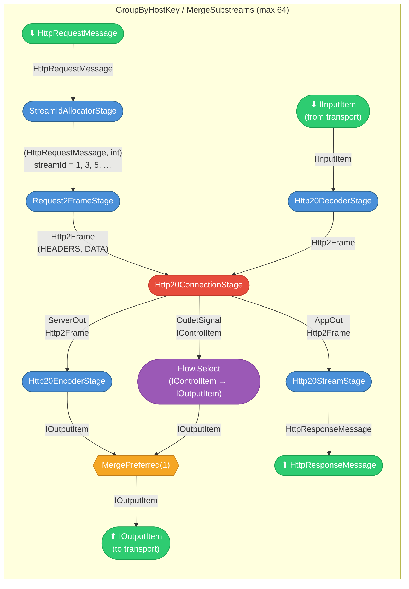
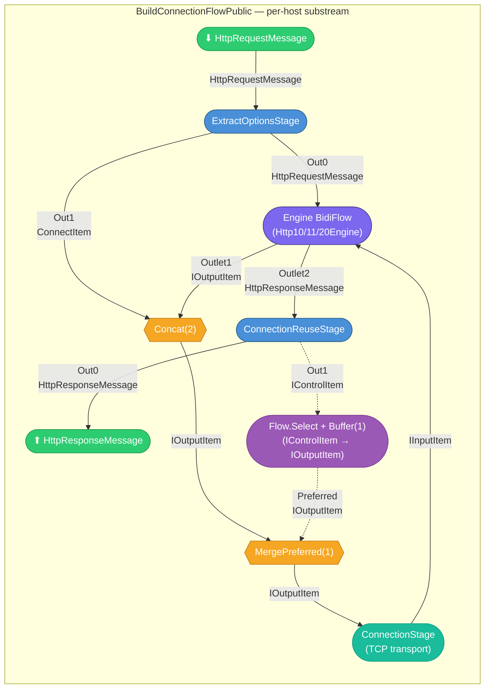

# Protocol Engine Sub-Graphs

Each protocol engine implements `IHttpProtocolEngine` and produces a `BidiFlow<HttpRequestMessage, IOutputItem, IInputItem, HttpResponseMessage>`.
In production, every engine is wrapped in a per-host substream topology:

```
GroupByHostKey → ExtractOptionsStage → Engine BidiFlow → ConnectionReuseStage → MergeSubstreams
```

The diagrams below show the **internal** graph of each engine's `CreateFlow()` method,
followed by the **connection wrapper** that is shared across all three.

> **Reading guide:** Rounded boxes are `GraphStage` implementations. Diamond shapes are fan-out/fan-in
> junctions. Data types are annotated on key edges.

---

## HTTP/1.0 Engine

Source: [`src/TurboHttp/Streams/Http10Engine.cs`](../src/TurboHttp/Streams/Http10Engine.cs)



### Stages

| Stage | Class | Purpose |
|-------|-------|---------|
| `Broadcast(2)` | Akka built-in | Splits request to encoder and correlator |
| `Http10EncoderStage` | `Streams/Stages/Http10EncoderStage.cs` | Serialises `HttpRequestMessage` → HTTP/1.0 bytes |
| `Http10DecoderStage` | `Streams/Stages/Http10DecoderStage.cs` | Parses HTTP/1.0 bytes → `HttpResponseMessage` |
| `Http1XCorrelationStage` | `Streams/Stages/Http1XCorrelationStage.cs` | FIFO request-response matching |
| `Sink.Ignore` | Akka built-in | Discards control signals (HTTP/1.0 has no signal feedback) |

---

## HTTP/1.1 Engine

Source: [`src/TurboHttp/Streams/Http11Engine.cs`](../src/TurboHttp/Streams/Http11Engine.cs)

Same structure as HTTP/1.0 but with `Http11EncoderStage` / `Http11DecoderStage` and a
`MergePreferred` junction that feeds correlation signals back into the transport output
(instead of discarding them).



### Stages

| Stage | Class | Purpose |
|-------|-------|---------|
| `Broadcast(2)` | Akka built-in | Splits request to encoder and correlator |
| `Http11EncoderStage` | `Streams/Stages/Http11EncoderStage.cs` | Serialises `HttpRequestMessage` → HTTP/1.1 bytes (Host header, chunked TE) |
| `Http11DecoderStage` | `Streams/Stages/Http11DecoderStage.cs` | Parses HTTP/1.1 bytes → `HttpResponseMessage` (chunked, keep-alive) |
| `Http1XCorrelationStage` | `Streams/Stages/Http1XCorrelationStage.cs` | FIFO request-response matching + control signal output |
| `Flow.Select` | Akka built-in | Casts `IControlItem` → `IOutputItem` for signal merge |
| `MergePreferred(1)` | Akka built-in | Merges encoder output (In0) with correlation signals (Preferred) |

### Difference from HTTP/1.0

- `Http11EncoderStage` / `Http11DecoderStage` replace their 1.0 counterparts
- Correlation signals are merged into the transport output via `MergePreferred` (preferred channel)
  instead of being discarded — this allows control items (e.g. connection-close) to reach `ConnectionStage`

---

## HTTP/2 Engine

Source: [`src/TurboHttp/Streams/Http20Engine.cs`](../src/TurboHttp/Streams/Http20Engine.cs)

HTTP/2 has a fundamentally different topology: stream multiplexing replaces the simple
broadcast-correlate pattern with a bidirectional `Http20ConnectionStage` that manages
stream IDs, flow control windows, and connection-level frames (SETTINGS, PING, GOAWAY).



### Stages

| Stage | Class | Purpose |
|-------|-------|---------|
| `StreamIdAllocatorStage` | `Streams/Stages/StreamIdAllocatorStage.cs` | Allocates client stream IDs (1, 3, 5, …) |
| `Request2FrameStage` | `Streams/Stages/Request2FrameStage.cs` | Converts `(HttpRequestMessage, streamId)` → HEADERS + DATA frames |
| `Http20ConnectionStage` | `Streams/Stages/Http20ConnectionStage.cs` | Bidirectional connection management: flow control, SETTINGS/PING/GOAWAY, stream backpressure |
| `Http20EncoderStage` | `Streams/Stages/Http20EncoderStage.cs` | Serialises `Http2Frame` → bytes (9-byte header + payload) |
| `Http20DecoderStage` | `Streams/Stages/Http20DecoderStage.cs` | Parses bytes → `Http2Frame` (stateful, handles TCP boundaries) |
| `Http20StreamStage` | `Streams/Stages/Http20StreamStage.cs` | Assembles frames into `HttpResponseMessage` (HPACK decode, END_STREAM) |
| `Flow.Select` | Akka built-in | Casts `IControlItem` → `IOutputItem` for signal merge |
| `MergePreferred(1)` | Akka built-in | Merges encoder output (In0) with connection signals (Preferred) |

### Http20ConnectionStage ports

| Port | Direction | Data | Description |
|------|-----------|------|-------------|
| `AppIn` | Inlet | `Http2Frame` | Application frames from `Request2FrameStage` |
| `ServerOut` | Outlet | `Http2Frame` | Outbound frames to `Http20EncoderStage` |
| `ServerIn` | Inlet | `Http2Frame` | Inbound frames from `Http20DecoderStage` |
| `AppOut` | Outlet | `Http2Frame` | Decoded frames to `Http20StreamStage` |
| `OutletSignal` | Outlet | `IControlItem` | Control signals (e.g. GOAWAY) to transport |

---

## Connection Wrapper (shared)

Source: [`src/TurboHttp/Streams/Engine.cs`](../src/TurboHttp/Streams/Engine.cs) — `BuildConnectionFlowPublic<TEngine>()`

In production, every engine is wrapped in this connection-level graph before being
placed inside `GroupByHostKey` / `MergeSubstreams`:



### Connection Wrapper Stages

| Stage | Class | Purpose |
|-------|-------|---------|
| `ExtractOptionsStage` | `Streams/Stages/ExtractOptionsStage.cs` | Buffers first request; emits `ConnectItem` (Out1) + requests (Out0) |
| Engine BidiFlow | `Http10Engine` / `Http11Engine` / `Http20Engine` | Protocol-specific encode/decode (see diagrams above) |
| `Concat(2)` | Akka built-in | Sequences `ConnectItem` before encoded request bytes |
| `MergePreferred(1)` | Akka built-in | Merges data (In0) with reuse signals (Preferred) → transport |
| `ConnectionStage` | `IO/Stages/ConnectionStage.cs` | TCP transport — communicates with actor-based connection pool |
| `ConnectionReuseStage` | `Streams/Stages/ConnectionReuseStage.cs` | Evaluates keep-alive/close; Out0 = response, Out1 = reuse signal |

## Legend

| Shape / Colour | Meaning |
|----------------|---------|
| Rounded box (blue) | `GraphStage` — stream processing stage |
| Rounded box (red) | `Http20ConnectionStage` — bidirectional connection manager |
| Rounded box (purple) | Protocol engine composite sub-graph |
| Rounded box (teal) | Transport stage (TCP) |
| Rounded box (violet) | Cast / buffer flow |
| Diamond (orange) | Fan-out / fan-in junction |
| Rounded box (grey) | Sink (signal discard) |
| Stadium (green) | BidiFlow port (inlet / outlet) |
| Solid arrow | Normal data flow |
| Dashed arrow | Signal feedback loop |
